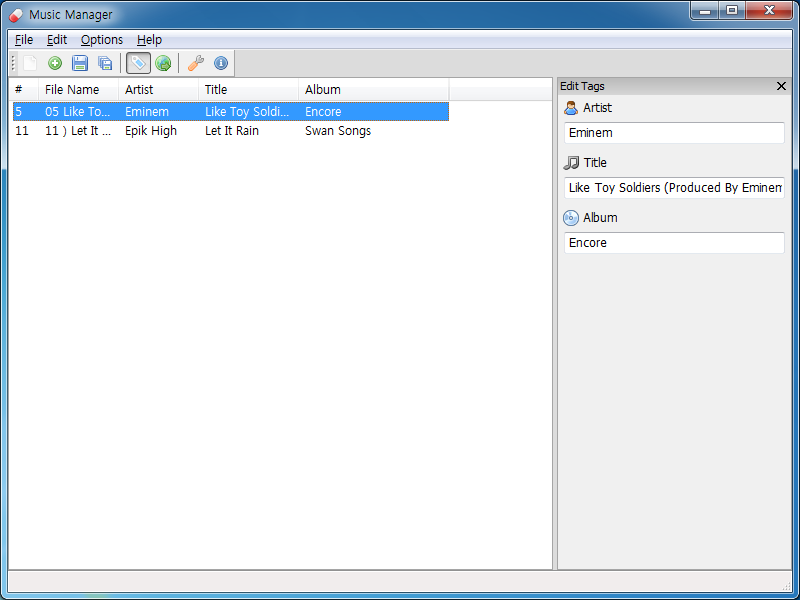

Music File Renamer
==================

A Windows GUI application which renames multiple music files by their ID3
informations.

This terrible project was my first Python project. It was written when I was 15
years old. But I didn't finish the project. So this program doesn't work
properly. I made this repository just to remember my past.
